# Замеры времени выполнения и использования памяти

Домашняя работа по алгоритмизации, занятие «От Big O к реальному коду».
Материал: [презентация ОП.04](https://algorthimization-course-vvodnoe.vercel.app/op04-algoritmizaciya/lessons/04-zamery-vremeni-i-pamyati/index.html#slide-1).

Все примеры из презентации запущены локально. На каждом скриншоте видны код программы,
команда запуска и полученные значения. Сырой вывод терминала сохранён в [`results/`](results).

## Условия эксперимента

| Параметр | Значение |
|---|---|
| Компьютер | MacBook Air, Apple M4, 16 GB RAM |
| ОС | macOS 26.3 |
| Python | 3.12.12 |
| Таймер | `time.perf_counter()` |
| Память | `tracemalloc`, пиковое значение `peak` |
| Повторы | медиана по `measure_time(..., repeats=N)` из [`measurements.py`](algorithm_measurements/measurements.py) |

> Абсолютные секунды зависят от машины и её загрузки. Смотрим на **характер роста**:
> во сколько раз меняется время при росте `n`. Память в коде подписана `MB`, но при делении
> на `1024**2` это MiB.

## Как запустить

```sh
cd algorithm_measurements
python3 02_first_measurement.py
```

## Содержание

| № | Пример | Что проверяем | Слайды |
|---|---|---|---|
| 1 | [Первый замер](#1-первый-реальный-замер) | `perf_counter()` на одном вызове | 6 |
| 2 | [Рост времени](#2-главное--рост-а-не-одно-число) | `O(n)` при `n ×10` | 7–8 |
| 3 | [Повторные запуски](#3-один-запуск-может-обмануть) | шум и медиана | 9–10 |
| 4 | [Граница замера](#4-измеряйте-нужную-операцию) | подготовка данных вне таймера | 11 |
| 5 | [Доступ по индексу](#5-доступ-к-элементу-списка--o1) | `O(1)` | 13–14 |
| 6 | [Линейный поиск](#6-линейный-поиск--on) | `O(n)` в худшем случае | 15–17 |
| 7 | [Вложенные циклы](#7-вложенные-циклы--on²) | `O(n²)` при `n ×2` | 18–21 |
| 8 | [Два O(n)](#8-два-on-разная-скорость) | константа реализации | 22–23 |
| 9 | [list против set](#9-list-против-set) | поиск `O(n)` против `O(1)` | 24–25 |
| 10 | [Память двух версий](#10-память-двух-реализаций) | `S(n) = O(n)` против `O(1)` | 26–31 |
| 11 | [list против generator](#11-list-против-generator) | время и память | 32 |
| 12 | [Финальный эксперимент](#12-финальный-эксперимент-поиск-дубликатов) | дубликаты: пары против set | 33–39 |

---

## 1. Первый реальный замер

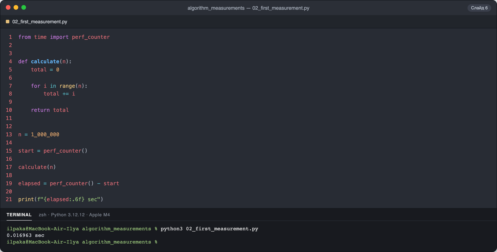

**Что измерялось.** Время одного вызова `calculate(1_000_000)`, суммирование в цикле, `T(n) = O(n)`.
Таймер охватывает только вызов функции.

**Результат.** `0.016963 sec`, то есть около 17 мс на миллион итераций.

**Вывод.** Одно число показывает только «сколько сейчас». По нему нельзя судить о сложности:
для этого нужно несколько размеров `n`.

## 2. Главное — рост, а не одно число

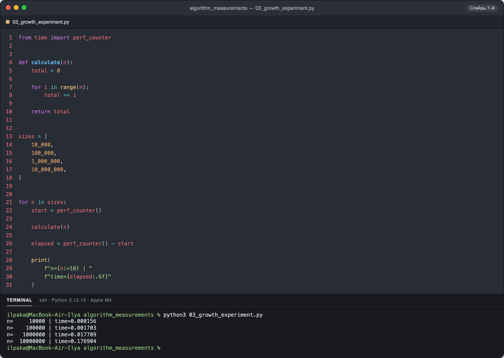

**Что измерялось.** Время `calculate(n)` для `n` = 10 000 … 10 000 000, каждый раз `n ×10`.

| n | Время, sec | Во сколько раз дольше |
|---:|---:|---:|
| 10 000 | 0.000156 | — |
| 100 000 | 0.001703 | ×10.9 |
| 1 000 000 | 0.017709 | ×10.4 |
| 10 000 000 | 0.176904 | ×10.0 |

**Вывод.** При увеличении входа в 10 раз время растёт примерно в 10 раз. Это согласуется с моделью
`T(n) = O(n)`. На маленьком `n` коэффициент чуть больше 10 из-за накладных расходов.

## 3. Один запуск может обмануть

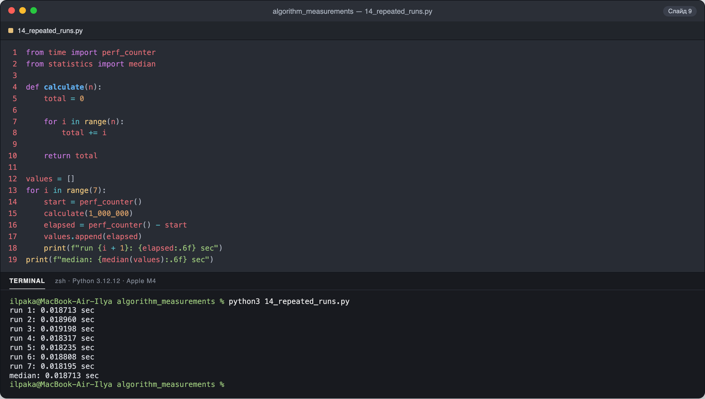

**Что измерялось.** Семь одинаковых запусков `calculate(1_000_000)` и их медиана.

| Запуск | 1 | 2 | 3 | 4 | 5 | 6 | 7 | **Медиана** |
|---|---|---|---|---|---|---|---|---|
| sec | 0.018713 | 0.018960 | 0.019198 | 0.018317 | 0.018235 | 0.018808 | 0.018195 | **0.018713** |

**Вывод.** Одинаковый код дал разное время: разброс от 0.01820 до 0.01920 sec, около 5 %. Его вызывают
ОС и фоновые процессы. Медиана устойчива к единичному медленному запуску, поэтому общий
измеритель `measure_time` в `measurements.py` возвращает именно её.

## 4. Измеряйте нужную операцию

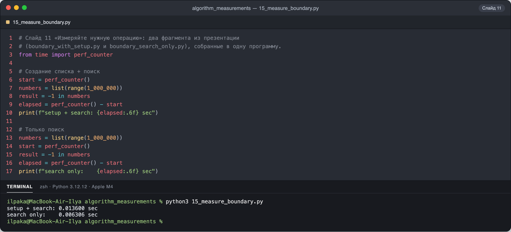

**Что измерялось.** Два фрагмента со слайда 11, собранные в [`15_measure_boundary.py`](algorithm_measurements/15_measure_boundary.py):
- в первом таймер охватывает создание списка из миллиона элементов вместе с поиском `-1 in numbers`;
- во втором — только поиск.

| Что внутри таймера | Время, sec |
|---|---:|
| создание списка + поиск | 0.013600 |
| только поиск | 0.006306 |

**Вывод.** Больше половины «времени поиска» в первом варианте уходило на подготовку данных. Чтобы
сравнивать алгоритмы, подготовку входа нужно выносить за границы таймера.

## 5. Доступ к элементу списка — O(1)

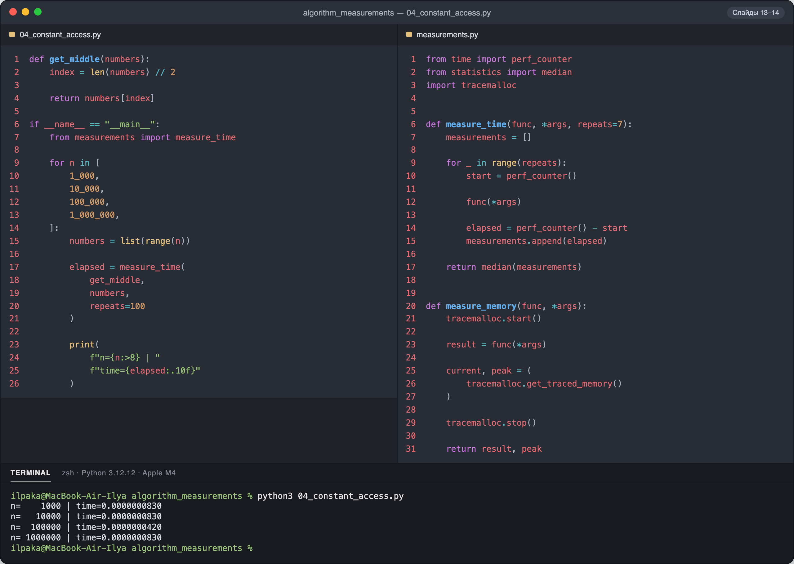

**Что измерялось.** Время `get_middle(numbers)`: взять элемент из середины списка по индексу,
медиана из 100 повторов. Список создаётся до замера.

| n | Время, sec |
|---:|---:|
| 1 000 | 0.0000000830 |
| 10 000 | 0.0000000830 |
| 100 000 | 0.0000000420 |
| 1 000 000 | 0.0000000830 |

**Вывод.** Список вырос в 1000 раз, а время осталось на уровне ~80 нс. Значения «прыгают» шагами
около 41 нс: это предел разрешения таймера. Доступ по индексу не зависит от длины списка, то есть `O(1)`.

## 6. Линейный поиск — O(n)

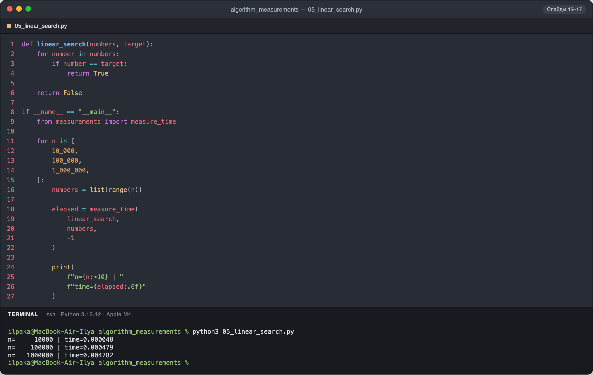

**Что измерялось.** Время `linear_search(numbers, -1)`. Значения `-1` в списке нет, поэтому это
контролируемый худший случай: просматривается весь список.

| n | Время, sec | Во сколько раз дольше |
|---:|---:|---:|
| 10 000 | 0.000048 | — |
| 100 000 | 0.000479 | ×10.0 |
| 1 000 000 | 0.004782 | ×10.0 |

**Вывод.** Рост почти идеально линейный: `n ×10` даёт время `×10`. Поиск отсутствующего
элемента исключает ранний выход и делает сравнение размеров честным.

## 7. Вложенные циклы — O(n²)

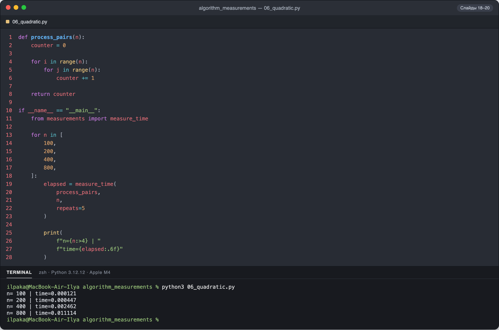

**Что измерялось.** Время `process_pairs(n)`: два вложенных цикла, `n²` операций `counter += 1`.
`n` каждый раз удваивается.

| n | Операций n² | Время, sec | Во сколько раз дольше |
|---:|---:|---:|---:|
| 100 | 10 000 | 0.000121 | — |
| 200 | 40 000 | 0.000447 | ×3.7 |
| 400 | 160 000 | 0.002462 | ×5.5 |
| 800 | 640 000 | 0.011114 | ×4.5 |

**Вывод.** При удвоении `n` время растёт в среднем в ~4.5 раза (теория: ×4). Это характерно для
квадратичного роста. Отклонения отдельных шагов (×3.7, ×5.5) объясняются шумом на коротких
замерах в доли миллисекунды.

## 8. Два O(n), разная скорость

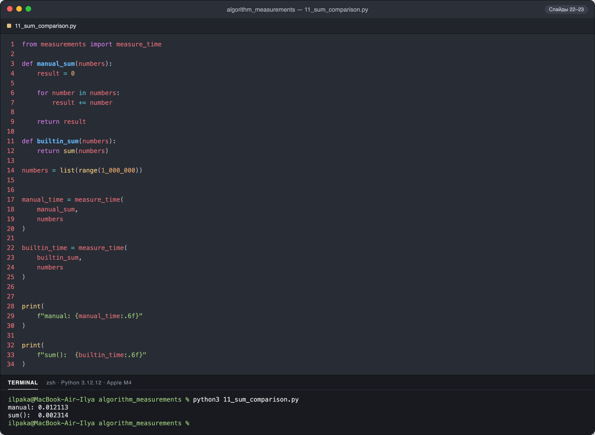

**Что измерялось.** Сумма списка из миллиона чисел: ручным циклом `manual_sum` и встроенной `sum()`.

| Реализация | Время, sec |
|---|---:|
| `manual_sum` (цикл на Python) | 0.012113 |
| `sum()` (встроенная, на C) | 0.002314 |

**Вывод.** Обе функции `O(n)`, но `sum()` быстрее в ~5.2 раза. Big O описывает масштабирование, а не
стоимость одной операции. Встроенная функция выполняет цикл в C без накладных расходов интерпретатора.

## 9. list против set

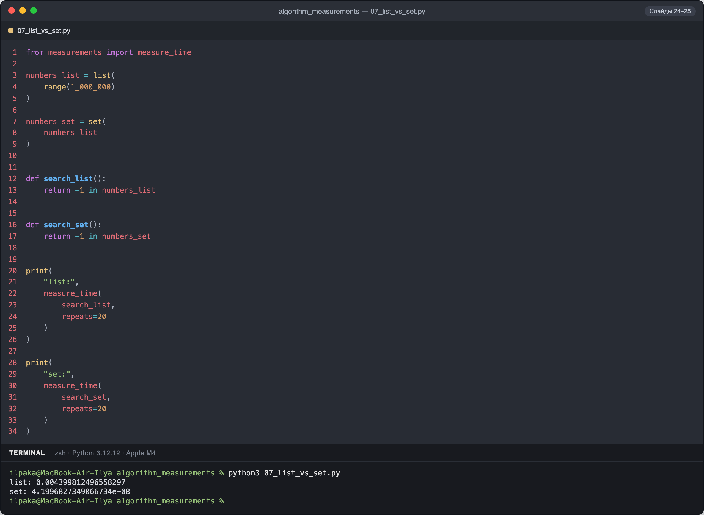

**Что измерялось.** Проверка отсутствующего ID `-1` в `list` и в `set` из миллиона элементов,
медиана из 20 повторов. Обе структуры созданы до замера.

| Структура | Время, sec |
|---|---:|
| `list` | 0.0043998 |
| `set` | 0.0000000420 |

**Вывод.** Поиск в `set` быстрее примерно в 100 000 раз. В `list` худший случай `O(n)`: перебираются
все элементы. В `set` хеш-таблица даёт ожидаемую `O(1)`. Для частых проверок наличия нужен `set`.

## 10. Память двух реализаций

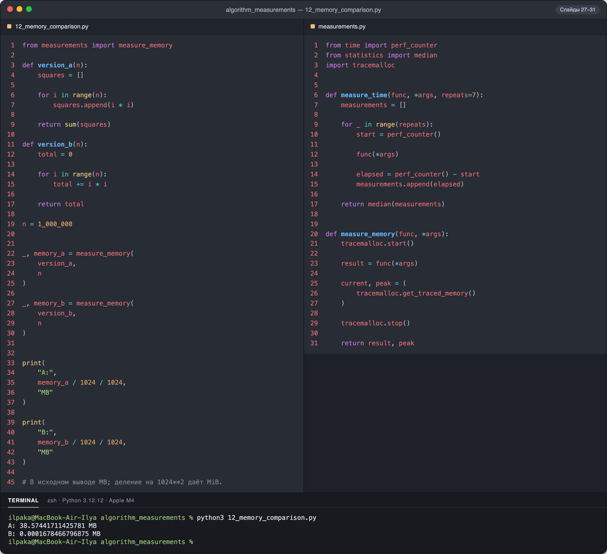

**Что измерялось.** Пиковая память (`tracemalloc`) при подсчёте суммы квадратов для `n = 1 000 000`:
- `version_a` сначала сохраняет все квадраты в список;
- `version_b` накапливает сумму в одной переменной.

| Версия | Теория S(n) | Пиковая память |
|---|---|---:|
| A — список квадратов | `O(n)` | 38.574 MiB |
| B — накопитель | `O(1)` | 0.000168 MiB (≈ 176 байт) |

**Вывод.** Результат и время у версий одинаковые (`O(n)`), а память отличается более чем в 200 000 раз.
Список из миллиона чисел занимает почти 40 MiB, а накопитель — несколько переменных.

## 11. list против generator

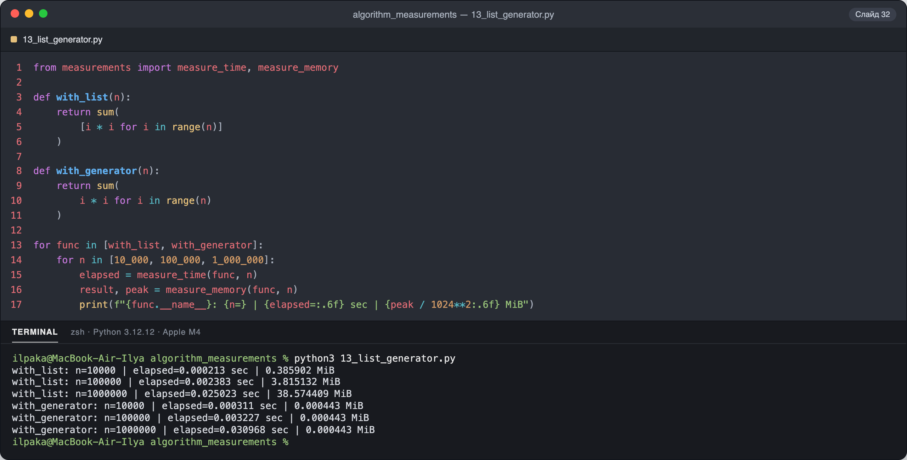

**Что измерялось.** Время и пиковая память `sum([i*i ...])` (списковое включение) и
`sum(i*i ...)` (генератор) для трёх размеров `n`.

| n | list, sec | list, MiB | generator, sec | generator, MiB |
|---:|---:|---:|---:|---:|
| 10 000 | 0.000213 | 0.386 | 0.000311 | 0.000443 |
| 100 000 | 0.002383 | 3.815 | 0.003227 | 0.000443 |
| 1 000 000 | 0.025023 | 38.574 | 0.030968 | 0.000443 |

**Вывод.**
- Память списка растёт вместе с `n` (×10 на шаг), а генератора остаётся постоянной, ≈ 464 байта.
- По времени генератор медленнее на 24–46 %, потому что каждое значение передаётся отдельно.

Это и есть компромисс «время против памяти».

## 12. Финальный эксперимент: поиск дубликатов

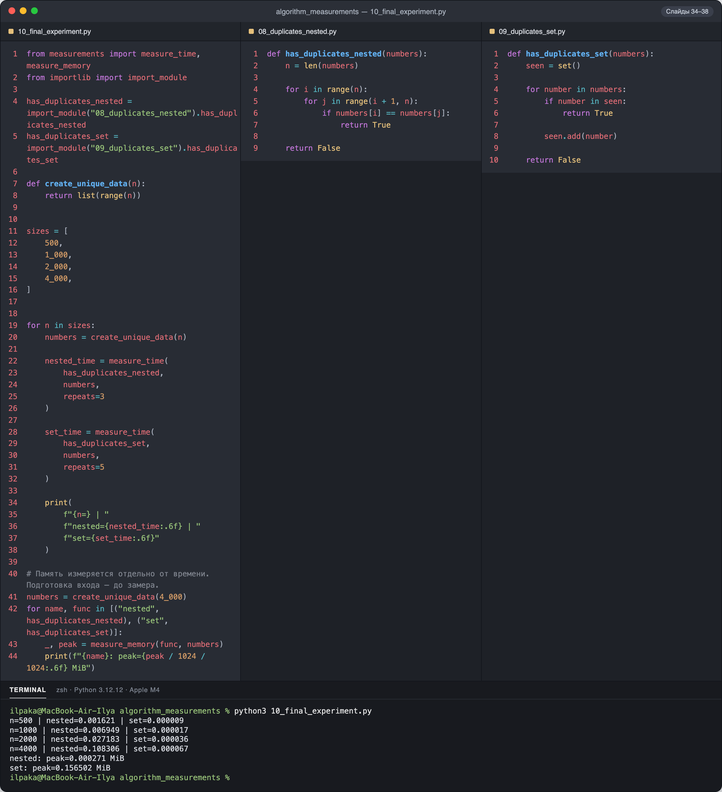

**Что измерялось.** Два решения задачи «есть ли повтор в списке ID» на уникальных данных
(досрочного выхода нет):
- `has_duplicates_nested` сравнивает каждую пару: `T = O(n²)`, `S = O(1)`;
- `has_duplicates_set` запоминает встреченные значения: `T = O(n)` в среднем, `S = O(n)`.

| n | nested, sec | рост | set, sec | рост | nested / set |
|---:|---:|---:|---:|---:|---:|
| 500 | 0.001621 | — | 0.000009 | — | ×180 |
| 1 000 | 0.006949 | ×4.3 | 0.000017 | ×1.9 | ×409 |
| 2 000 | 0.027183 | ×3.9 | 0.000036 | ×2.1 | ×755 |
| 4 000 | 0.108306 | ×4.0 | 0.000067 | ×1.9 | ×1616 |

| Решение (n = 4 000) | Пиковая память |
|---|---:|
| nested | 0.000271 MiB (≈ 284 байта) |
| set | 0.156502 MiB (≈ 160 КиБ) |

**Вывод.**
- При удвоении `n` вложенные циклы замедляются в ~4 раза, а решение с `set` — в ~2 раза. Прогноз
  `O(n²)` против `O(n)` подтвердился, и разрыв растёт: при `n = 4 000` уже в 1600 раз.
- Скорость `set` оплачена памятью: ~160 КиБ против ~0.3 КиБ.

На больших данных выбирают `set`. Решение с парами имеет смысл только при жёстком ограничении памяти и малых `n`.

---

## Итоговая таблица

| Операция | T(n) | S(n) | Подтверждено замером |
|---|---|---|---|
| Доступ по индексу `list` | `O(1)` | `O(1)` | время не меняется при `n ×1000` |
| Линейный поиск | `O(n)` | `O(1)` | `n ×10` → время `×10.0` |
| Вложенные циклы | `O(n²)` | `O(1)` | `n ×2` → время `×4.5` |
| Ручная сумма / `sum()` | `O(n)` | `O(1)` | одинаковый рост, `sum()` в 5.2 раза быстрее |
| Поиск в `list` / готовом `set` | `O(n)` / `O(1)` | `O(1)` | `set` быстрее в ~10⁵ раз |
| Список квадратов / накопитель | `O(n)` | `O(n)` / `O(1)` | 38.6 MiB против 176 байт |
| list / generator | `O(n)` | `O(n)` / `O(1)` | память ×10 на шаг против постоянной |
| Дубликаты: пары / set | `O(n²)` / `O(n)` | `O(1)` / `O(n)` | `×4` против `×2` при удвоении `n` |

## Общий вывод

Замеры на моём компьютере согласуются с теоретическими оценками. Big O верно предсказал **характер
роста** времени и памяти, но не абсолютные секунды:
- два алгоритма `O(n)` могут отличаться по скорости в разы;
- выигрыш по времени часто оплачивается памятью (`set`, список квадратов).

Чтобы эксперимент был честным, нужно:
- делать несколько повторов и брать медиану;
- выносить подготовку данных за границы таймера;
- использовать одинаковые условия (худший случай без раннего выхода);
- сравнивать рост на нескольких размерах `n`, а не одно число.

## Структура папки

```text
lesson-01/
├── README.md                 отчёт
├── screenshots/              12 скриншотов: код + запуск + результат
├── results/                  сырой вывод каждого запуска
└── algorithm_measurements/   исходный код примеров из материалов занятия
```
